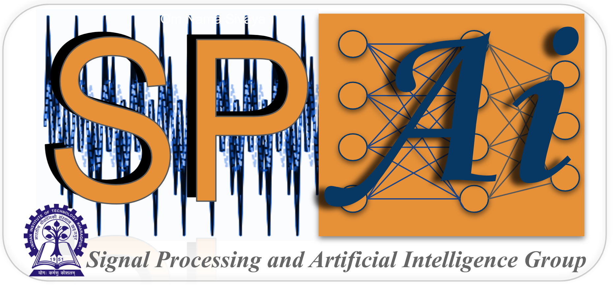

<!-- Om Nama Sivaya-->
<!-- Om Nama Sivaya-->
<!-- 
  You can also find my articles on <u><a href="{{author.googlescholar}}">my Google Scholar profile</a>.</u>
-->

<!---->

<!--
  
-->

<!--<html lang="en"><head><meta http-equiv="Content-Type" content="text/html; charset=UTF-8">-->
  <!-- Hi, Jon Here. Please DELETE the two 

 <table style="width:100%;border:0px;border-spacing:0px;border-collapse:collapse;margin-right:auto;margin-left:auto;"><tbody>
            <tr>
            <td style="padding:8px;width:100%;vertical-align:middle;border:0px">
                 

<i>The strength of the team is each individual member. The strength of each member is the team. -- Phil Jackson, one of the greatest coaches of all time </i>

              

            </td>
          </tr>

</tbody></table>

         
