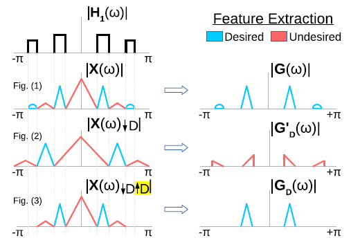

   This section contains a series of SPAI talks focusing on Understanding Complex-valued AI. 

<html>
<head>

</head>
<body>
<table>
  <tr>
    <th>Title</th>
    <th>Speaker</th>
    <th>Resources</th>
  </tr>
  <tr>
    <td>On Optimizing Complex-valued Neural Network</td>
    <td>Amara Datta Dola (MSc Thesis)</td>
    <td><a href="https://drive.google.com/file/d/1xkGMnrILh7PG91RFmpo-UvuPIyKZdsfX/view?usp=sharing">&#91;Slides&#93;</a></td>
  </tr>
</table>
</body>
</html>

 

<table style="width:100%;border:0px;border-spacing:0px;border-collapse:collapse;margin-right:auto;margin-left:auto;"><tbody>
            <tr>
            <td style="padding:20px;border:0px;border-bottom: 0px solid #ddd;width:100%;vertical-align:middle">
              <heading>Representative Publications</heading>  
              (Pl find the complete list of articles on <a href="https://scholar.google.com/citations?user=gNshB_kAAAAJ&hl=en">this Google Scholar profile</a>. For codes, please send us a mail.)
                </td>
          </tr> 
</tbody> 
       </table>
         <table style="width:100%;border: 0px solid black;;border-spacing:0px;border-collapse:collapse;margin-right:auto;margin-left:auto;"><tbody>
           <!-- Om Nama Sivaya -->
           <!-- Computer and Agriculture 2022 ONS -->
          <tr onmouseout="tip_stop()" onmouseover="tip_start()">
            <td style="padding:20px;width:29%;vertical-align:middle;border:0px;border-bottom: 1px solid #ddd;">
              

                

                
              

              
            </td>
            <td style="padding:20px;width:71%;vertical-align:middle;border:0px;border-bottom: 1px solid #ddd;">
              <a href="TODO">
                <papertitle>Deep Dynamic Scene Deblurring for Unconstrained Dual-lens Cameras</papertitle>
              </a>
               
              <strong>Mahesh Mohan M. R.</strong>,
              G K Nithin, and 
              <a href="http://www.ee.iitm.ac.in/~raju/">A. N. Rajagopalan </a>
               
              <em>IEEE Transactions on Image Processing </em>, 2021 
                <a href="../files/tip_ons.pdf">paper</a> /
              <a href="../files/tip_ons_bib.pdf">bib</a> 
               
              

              
A Deep Learning approach for motion deblurring for dual-lens cameras to address incoherent views, ill-posedness, and adaptive scale. 

            </td>
          </tr>
<table style="width:100%;border:0px;border-spacing:0px;border-collapse:collapse;margin-right:auto;margin-left:auto;"><tbody>
            <tr>
            <td style="padding:8px;width:100%;vertical-align:middle;border:0px">
                 

<i>Nothing in life is to be feared, it is only to be understood. Now is the time to understand more, so that we may fear less. -- Marie Curie, Nobel Laureate in Chemistry </i>

              

            </td>
          </tr>

</tbody></table>

